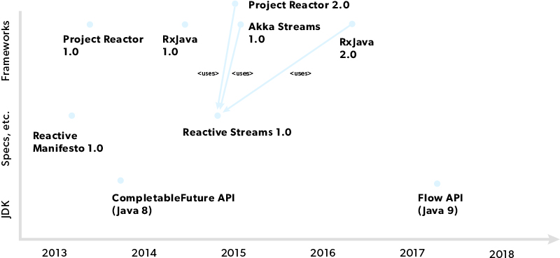

# java-kata-completablefuture

## What’s a CompletableFuture?

CompletableFuture is used for asynchronous programming in Java. Asynchronous programming is a means of writing non-blocking code by running a task on a separate thread than the main application thread and notifying the main thread about its progress, completion or failure.

## Javadoc

https://docs.oracle.com/en/java/javase/14/docs/api/java.base/java/util/concurrent/CompletableFuture.html

## Why CompletableFuture?

**Future limitations:**

- It cannot be manually completed
- You cannot perform further action on a Future’s result without blocking
- Multiple Futures cannot be chained together
- You cannot combine multiple Futures together
- No Exception Handling

## Classic rules

When you plan to run some tasks concurrently, the optimal thread configuration depends on how CPU-intence your tasks are. The classic rules are:

- A. For math calculations and other pure CPU tasks, use one thread per physical CPU core: say, a pool of 4 threads would be optimal for a quad-core machine.
- B. For tasks that do not involve CPU at all (network and other slow IOs, waiting for events, etc), create a thread per task.
- AB. For tasks that involve some CPU load and some waiting, balance the thread number between the numbers from the cases A and B according to the expected CPU utilization percentage. A popular formula from a Brian Goetz’s book recommendsthreads = cores * (1 + Waiting time / CPU time)

For case B, the idea of dedicated threads is good as long as the OS is still able to provide the threads as required. When the number of tasks grows over thousands, the overhead of creating native OS threads becomes too heavy. Here’s where the virtual threads should come in help.

## Concepts

- Parallel Calls
- Exception handling
- Timeouts
- Compose calls
- Discard failed calls

## References

- https://www.nurkiewicz.com/2015/03/completablefuture-cant-be-interrupted.html
- https://www.jrebel.com/blog/java-completablefuture-api
- https://thepracticaldeveloper.com/2018/02/24/differences-between-completablefuture-future-and-streams/

